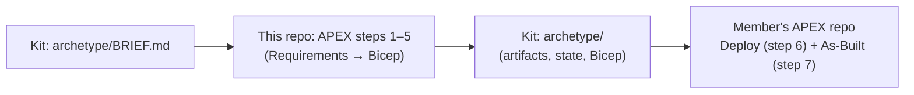

<!-- markdownlint-disable MD033 MD041 -->

# APEX Factory CoE

<div align="center">
  
</div>

> The Center of Excellence (CoE) workspace for the
> [Partner Modernization Factory hackathon](https://github.com/jonathan-vella/apex-factory-hackathon).
> The CoE uses [APEX](https://apexops.pro/) here to design and build the **CoE archetype** that every
> hackathon member later deploys into their vended spoke.

[](https://azure.microsoft.com)
[](https://github.com/Azure/bicep)
[](https://github.com/features/copilot)
[](LICENSE)

## What this repo is for

This repo was created from the [`apex-accelerator`](https://github.com/jonathan-vella/apex-accelerator)
template. It is where the CoE runs APEX steps 1–5 for the hackathon's landing-zone workload, passing every
human gate and challenger review. It is not the hackathon kit and attendees don't work in it.



1. **Input.** [`archetype/BRIEF.md`](https://github.com/jonathan-vella/apex-factory-hackathon/issues/9) in the
   hackathon kit is the workload brief pasted into Step 1 (Requirements).
2. **Build.** APEX runs Requirements → Architecture → Design → Governance → IaC Plan → Bicep code here.
3. **Package.** The finished project (`agent-output/university/`, `infra/bicep/university/`) is copied into the
   kit's `archetype/` folder, pinned to this repo's commit.
4. **Deploy.** At the event, each member copies `archetype/` into their own APEX repo and runs only APEX Deploy
   and As-Built, supplying a tenant ID, subscription ID and unique suffix.

## The archetype

| Item           | Value                                                                                 |
| -------------- | ------------------------------------------------------------------------------------- |
| APEX project   | `university` (Contoso University)                                                     |
| IaC            | Bicep only, AVM modules where available                                               |
| Target         | The member's existing vended Corp spoke under ALZ-lite (no new VNet, subnets or DNS)  |
| Services       | App Service for Linux (containers), ACR Premium, SQL Managed Instance General Purpose, Blob Storage, Service Bus Premium, Key Vault, Application Insights |
| Region         | Derived from the hub (`swedencentral` by default)                                     |
| Governance     | Must pass every ALZ-lite deny policy; private endpoints register in the central DNS zones by policy |

Scope and decisions live in the kit's [PRD](https://github.com/jonathan-vella/apex-factory-hackathon/blob/main/docs/prd.md)
and backlog item [B09](https://github.com/jonathan-vella/apex-factory-hackathon/issues/9).

## Repo layout

```text
agent-output/university/   # APEX artifacts, challenger reviews and workflow state
infra/bicep/university/    # Bicep produced by APEX step 5
.github/                   # APEX agents, skills, instructions (upstream-managed)
tools/                     # APEX scripts and MCP servers (upstream-managed)
```

## Setup

You need VS Code, GitHub Copilot, Docker Desktop (or Codespaces) and access to the hackathon build tenant.

1. Open the repo in the dev container (**Dev Containers: Reopen in Container**).
2. Initialize once, then commit the result:

   ```bash
   npm install
   npm run init
   npm run sync:workflows
   ```

3. Sign in with `az login` and run `npm run setup` if you want the governance baseline workflow. Otherwise
   APEX's Governance step (3.5) discovers policy from your signed-in subscription.

See the [APEX docs](https://apexops.pro/) for the full setup and the
[prompt guide](https://apexops.pro/guides/prompt-guide/) for running each step.

## Running the workflow

1. Select the **02-Requirements** agent (Step 1) and paste the whole of `archetype/BRIEF.md`. Answer every
   SKU question with the brief's pinned values, and confirm the existing vended spoke for networking.
2. Continue through Steps 2–5, passing every human gate and challenger review.
3. Commit, then hand the repo URL and commit SHA to the hackathon kit's B09 owner for packaging.

Don't run APEX Deploy (step 6) here. Deployment is validated from the kit's `archetype/` copy.

## Staying in sync with APEX

`README.md`, `agent-output/`, `infra/bicep/` and `.github/workflows/` are yours and survive the weekly
upstream sync. Everything else follows [APEX](https://github.com/jonathan-vella/apex). Before re-packaging the
archetype after a sync, re-run the affected steps and record the new commit in the kit's `versions.md`.

```bash
npm run validate:all
bicep lint infra/bicep/university/main.bicep
```

## License

[MIT](LICENSE)
