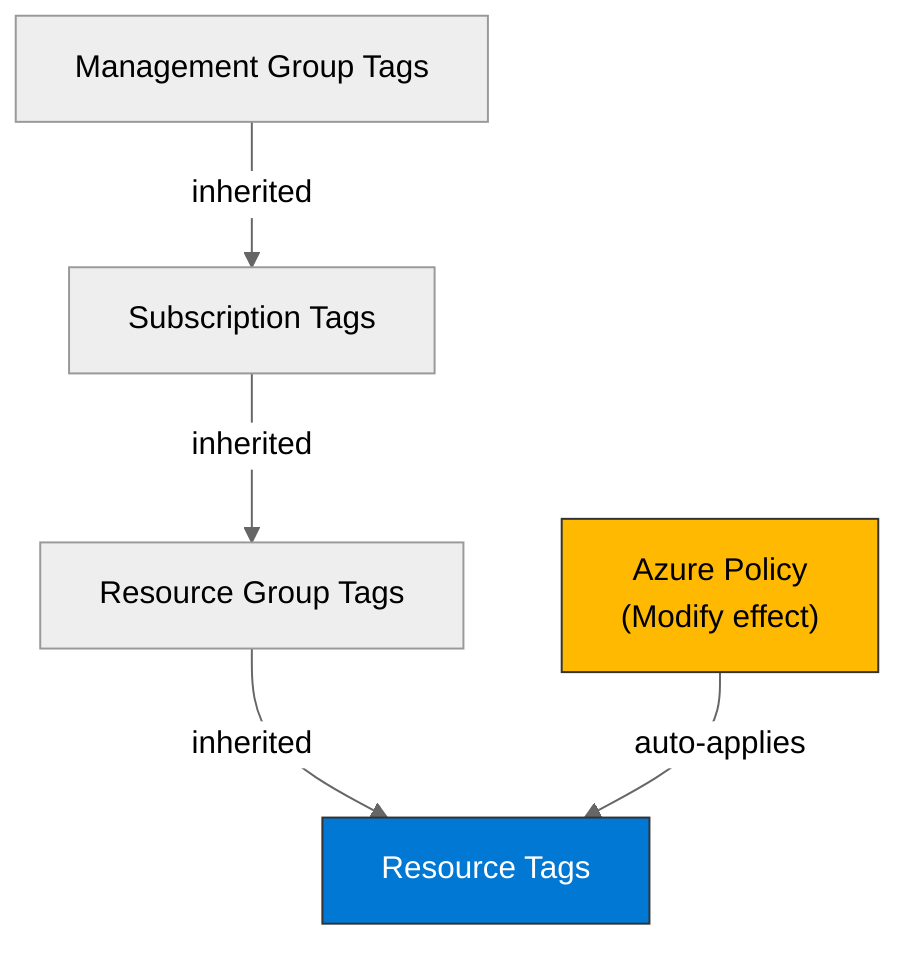

# 🛡️ Governance Constraints - university

<strong>📑 Governance Contents</strong>

- [🔍 Discovery Source](#-discovery-source)
- [📋 Azure Policy Compliance](#-azure-policy-compliance)
- [🔄 Plan Adaptations Based on Policies](#-plan-adaptations-based-on-policies)
- [🚫 Deployment Blockers](#-deployment-blockers)
- [🏷️ Required Tags](#-required-tags)
- [🔐 Security Policies](#-security-policies)
- [💰 Cost Policies](#-cost-policies)
- [🌐 Network Policies](#-network-policies)
- [📜 Compliance Frameworks](#-compliance-frameworks)
- [References](#references)

> Generated by 04g-Governance agent | 2026-10-06T10:16:59Z

| ⬅️ Previous | 📑 Index | Next ➡️ |
| --- | --- | --- |
| [02-architecture-assessment.md](02-architecture-assessment.md) | [README](README.md) | [04-implementation-plan.md](04-implementation-plan.md) |

## 🔍 Discovery Source

| Query | Results | Timestamp |
| --- | --- | --- |
| Policy Assignments | 25 policies discovered | 2026-10-06T10:16:59Z |
| Tag Policies | 0 tags required | 2026-10-06T10:16:59Z |
| Security Policies | 11 constraints | 2026-10-06T10:16:59Z |

**Discovery Method**: Azure Policy REST API (discover.py)
**Subscription**: 582da6a2-2ecc-4cba-8495-7b3564a46284
**Scope**: Subscription + management-group inherited

> ⚠️ **17 deployment blocker(s)** detected. Review the [Deployment Blockers](#-deployment-blockers) section before proceeding to IaC planning.

### Policy Definition Analysis

| Policy Display Name | Assignment Scope | Effect | Classification | Category | Bicep Property Path | Required Value |
| --- | --- | --- | --- | --- | --- | --- |
| Block VM SKU Sizes | /providers/Microsoft.Management/managementGroups/30bac921-1547-4b1e-8445-72455da783f1 | deny | blocker | Compute |  | Standard_HB120-16rs_v2, Standard_HB120-16rs_v3, Standard_HB120-32rs_v2, Standard_HB120-32rs_v3, Standard_HB120-64rs_v2, Standard_HB120-64rs_v3, Standard_HB120-96rs_v2, Standard_HB120-96rs_v3, Standard_HB120rs_v2, Standard_HB120rs_v3, Standard_HB60-15rs, Standard_HB60-30rs, Standard_HB60-45rs, Standard_HB60rs, Standard_HC44-16rs, Standard_HC44-32rs, Standard_HC44rs |
| Deny AKS deployment with agent pool count greater than 10 | /providers/Microsoft.Management/managementGroups/30bac921-1547-4b1e-8445-72455da783f1 | deny | blocker | Compute | managedClusters::agentPoolProfiles[*] |  |
| Deny VMSS deployment with instance count greater than 10 | /providers/Microsoft.Management/managementGroups/30bac921-1547-4b1e-8445-72455da783f1 | deny | blocker | Compute | virtualMachineScaleSets::sku.capacity |  |
| Block Azure OpenAI Provisioned Capacity | /providers/Microsoft.Management/managementGroups/30bac921-1547-4b1e-8445-72455da783f1 | deny | blocker | Cognitive Services | accounts/deployments::sku.name |  |
| Block Azure Sentinel Commitment over 100 | /providers/Microsoft.Management/managementGroups/30bac921-1547-4b1e-8445-72455da783f1 | deny | blocker | Monitoring | workspaces::sku.capacityReservationLevel |  |
| SFI-ID4.2.2 SQL DB - Safe Secrets Standard | /providers/Microsoft.Management/managementGroups/30bac921-1547-4b1e-8445-72455da783f1 | deny | blocker | Uncategorized | sqlServers::administrators.azureADOnlyAuthentication | Ignore |
| SFI-ID4.2.4 SQL Managed Instance - Safe Secrets Standard | /providers/Microsoft.Management/managementGroups/30bac921-1547-4b1e-8445-72455da783f1 | deny | blocker | Uncategorized | managedInstances::administrators.azureADOnlyAuthentication | Ignore |
| Not allowed resource types | /providers/Microsoft.Management/managementGroups/30bac921-1547-4b1e-8445-72455da783f1 | deny | blocker | General |  | microsoft.classiccompute/virtualmachines, microsoft.classiccompute/virtualmachines/diagnosticsettings, microsoft.classiccompute/virtualmachines/metricdefinitions, microsoft.classiccompute/virtualmachines/metrics, microsoft.classicnetwork/virtualnetworks, microsoft.classicnetwork/virtualnetworks/remotevirtualnetworkpeeringproxies, microsoft.classicnetwork/virtualnetworks/virtualnetworkpeerings, microsoft.classicstorage/checkstorageaccountavailability, microsoft.classicstorage/storageaccounts, microsoft.classicstorage/storageaccounts/blobservices, microsoft.classicstorage/storageaccounts/fileservices, microsoft.classicstorage/storageaccounts/metricdefinitions, microsoft.classicstorage/storageaccounts/metrics, microsoft.classicstorage/storageaccounts/queueservices, microsoft.classicstorage/storageaccounts/services, microsoft.classicstorage/storageaccounts/services/diagnosticsettings, microsoft.classicstorage/storageaccounts/services/metricdefinitions, microsoft.classicstorage/storageaccounts/services/metrics, microsoft.classicstorage/storageaccounts/tableservices, microsoft.classicstorage/storageaccounts/vmimages … +37 more |
| Deny Azure Key Vault Managed HSM with Purge Protection Enabled | /providers/Microsoft.Management/managementGroups/30bac921-1547-4b1e-8445-72455da783f1 | deny | blocker | Key Vault |  | CostControl |
| Configure Azure Defender for servers to be enabled | /providers/Microsoft.Management/managementGroups/30bac921-1547-4b1e-8445-72455da783f1 | deployIfNotExists | auto-remediate | Security Center |  |  |
| Configure Microsoft Defender for Key Vault plan | /providers/Microsoft.Management/managementGroups/30bac921-1547-4b1e-8445-72455da783f1 | deployIfNotExists | auto-remediate | Security Center |  | PerKeyVault |
| Configure Microsoft Defender for Azure Cosmos DB to be enabled | /providers/Microsoft.Management/managementGroups/30bac921-1547-4b1e-8445-72455da783f1 | deployIfNotExists | auto-remediate | Security Center |  |  |
| Configure Azure Defender for Azure SQL database to be enabled | /providers/Microsoft.Management/managementGroups/30bac921-1547-4b1e-8445-72455da783f1 | deployIfNotExists | auto-remediate | Security Center |  |  |
| Configure Azure Defender for SQL servers on machines to be enabled | /providers/Microsoft.Management/managementGroups/30bac921-1547-4b1e-8445-72455da783f1 | deployIfNotExists | auto-remediate | Security Center |  |  |
| Configure Azure Defender for open-source relational databases to be enabled | /providers/Microsoft.Management/managementGroups/30bac921-1547-4b1e-8445-72455da783f1 | deployIfNotExists | auto-remediate | Security Center |  |  |
| Configure Microsoft Defender for Containers to be enabled | /providers/Microsoft.Management/managementGroups/30bac921-1547-4b1e-8445-72455da783f1 | deployIfNotExists | auto-remediate | Security Center |  |  |
| Configure Azure Defender for App Service to be enabled | /providers/Microsoft.Management/managementGroups/30bac921-1547-4b1e-8445-72455da783f1 | deployIfNotExists | auto-remediate | Security Center |  |  |
| Configure Azure Defender for Resource Manager to be enabled | /providers/Microsoft.Management/managementGroups/30bac921-1547-4b1e-8445-72455da783f1 | deployIfNotExists | auto-remediate | Security Center |  | PerSubscription |
| Configure Microsoft Defender for Storage to be enabled | /providers/Microsoft.Management/managementGroups/30bac921-1547-4b1e-8445-72455da783f1 | deployIfNotExists | auto-remediate | Security Center |  | true |
| Configure Microsoft Defender threat protection for AI Services | /providers/Microsoft.Management/managementGroups/30bac921-1547-4b1e-8445-72455da783f1 | deployIfNotExists | auto-remediate | Security Center |  | true |
| Deploy the Windows Guest Configuration extension to enable Guest Configuration assignments on Windows VMs | /providers/Microsoft.Management/managementGroups/30bac921-1547-4b1e-8445-72455da783f1 | deployIfNotExists | auto-remediate | Guest Configuration | virtualMachines::storageProfile.osDisk.osType |  |
| Add system-assigned managed identity to enable Guest Configuration assignments on virtual machines with no identities | /providers/Microsoft.Management/managementGroups/30bac921-1547-4b1e-8445-72455da783f1 | modify | auto-remediate | Managed Identity for Guest Configuration |  | SystemAssigned |
| Add system-assigned managed identity to enable Guest Configuration assignments on VMs with a user-assigned identity | /providers/Microsoft.Management/managementGroups/30bac921-1547-4b1e-8445-72455da783f1 | modify | auto-remediate | Managed identity for Guest Configuration |  | [concat(field('identity.type'), ',SystemAssigned')] |
| Ensure secure access to storage account containers | /providers/Microsoft.Management/managementGroups/30bac921-1547-4b1e-8445-72455da783f1 | modify | auto-remediate | Modify Allow Blob anonymous access | storageAccounts::allowBlobPublicAccess | false |
| SFI-ID4.3.2 Event Hub - Safe Secrets Standard | /providers/Microsoft.Management/managementGroups/30bac921-1547-4b1e-8445-72455da783f1 | modify | auto-remediate | Uncategorized | namespaces::disableLocalAuth | true |
| SFI-ID4.3.3 Service Bus - Safe Secrets Standard | /providers/Microsoft.Management/managementGroups/30bac921-1547-4b1e-8445-72455da783f1 | modify | auto-remediate | Uncategorized | namespaces::disableLocalAuth | true |
| SFI-ID4.2.1 Storage Accounts - Safe Secrets Standard | /providers/Microsoft.Management/managementGroups/30bac921-1547-4b1e-8445-72455da783f1 | modify | auto-remediate | Uncategorized | storageAccounts::allowSharedKeyAccess | false |
| SFI-ID4.2.3 Cosmos DB - Safe Secrets Standard | /providers/Microsoft.Management/managementGroups/30bac921-1547-4b1e-8445-72455da783f1 | modify | auto-remediate | Uncategorized | databaseAccounts::disableLocalAuth | true |
| AzTB 17 - Enable Diagnostics Settings for all Cognitive Services | /providers/Microsoft.Management/managementGroups/30bac921-1547-4b1e-8445-72455da783f1 | deployIfNotExists | auto-remediate | Uncategorized |  | setByPolicy-MCAPSGovernance |
| AzTB 17 - Azure_AIFoundry_Audit_Enable_Diagnostic_Settings - Hubs | /providers/Microsoft.Management/managementGroups/30bac921-1547-4b1e-8445-72455da783f1 | deployIfNotExists | auto-remediate | Uncategorized |  | setByPolicy-MCAPSGovernance |
| AzTB 17 - Azure_AIFoundry_Audit_Enable_Diagnostic_Settings - Projects | /providers/Microsoft.Management/managementGroups/30bac921-1547-4b1e-8445-72455da783f1 | deployIfNotExists | auto-remediate | Uncategorized |  | setByPolicy-MCAPSGovernance |
| Disable Local auth for all Cognitive Services | /providers/Microsoft.Management/managementGroups/30bac921-1547-4b1e-8445-72455da783f1 | modify | auto-remediate | Uncategorized | accounts::disableLocalAuth | true |
| Deploy Resource Group McapsGovernance | /providers/Microsoft.Management/managementGroups/30bac921-1547-4b1e-8445-72455da783f1 | deployIfNotExists | auto-remediate | Uncategorized |  | McapsGovernance |
| Deploy Log Analytics Workspace for Diagnostic Settings | /providers/Microsoft.Management/managementGroups/30bac921-1547-4b1e-8445-72455da783f1 | deployIfNotExists | auto-remediate | Uncategorized |  | McapsGovernance |
| AIFoundryHub_PublicNetwork_Modify | /providers/Microsoft.Management/managementGroups/30bac921-1547-4b1e-8445-72455da783f1 | modify | auto-remediate | Uncategorized | workspaces::publicNetworkAccess | Disabled |
| SFI - Disable public network access on Storage accounts (excluding NSP configured resources) | /providers/Microsoft.Management/managementGroups/30bac921-1547-4b1e-8445-72455da783f1 | modify | auto-remediate | Network | storageAccounts::publicNetworkAccess | Disabled |
| SFI - Disable public network access on Key Vaults (excluding NSP configured resources) | /providers/Microsoft.Management/managementGroups/30bac921-1547-4b1e-8445-72455da783f1 | modify | auto-remediate | Network | keyVaults::publicNetworkAccess | Disabled |
| SFI - Disable public network access on Cosmos DB accounts (excluding NSP configured resources) | /providers/Microsoft.Management/managementGroups/30bac921-1547-4b1e-8445-72455da783f1 | modify | auto-remediate | Network | databaseAccounts::publicNetworkAccess | Disabled |
| SFI - Disable public network access on SQL DB servers (excluding NSP configured resources) | /providers/Microsoft.Management/managementGroups/30bac921-1547-4b1e-8445-72455da783f1 | modify | auto-remediate | Network | sqlServers::publicNetworkAccess | Disabled |
| Configure Microsoft Defender CSPM plan | /providers/Microsoft.Management/managementGroups/30bac921-1547-4b1e-8445-72455da783f1 | deployIfNotExists | auto-remediate | Uncategorized |  |  |
| Configure Node OS Auto upgrade on Azure Kubernetes Cluster | /providers/Microsoft.Management/managementGroups/30bac921-1547-4b1e-8445-72455da783f1 | deployIfNotExists | auto-remediate | Uncategorized |  | NodeImage |
| AzTB 17 - Configure Diagnostics Setting for Logic app | /providers/Microsoft.Management/managementGroups/30bac921-1547-4b1e-8445-72455da783f1 | deployIfNotExists | auto-remediate | Uncategorized |  | setByPolicy-MCAPSGovernance |
| AzTB 17 - Configure Diagnostics Setting for Logic app Standard | /providers/Microsoft.Management/managementGroups/30bac921-1547-4b1e-8445-72455da783f1 | deployIfNotExists | auto-remediate | Uncategorized |  | setByPolicy-MCAPSGovernance |
| AzTB 17 - Configure Diagnostics Setting for Function apps | /providers/Microsoft.Management/managementGroups/30bac921-1547-4b1e-8445-72455da783f1 | deployIfNotExists | auto-remediate | Uncategorized |  | setByPolicy-MCAPSGovernance |
| Block Azure RM Resource Creation | /providers/Microsoft.Management/managementGroups/30bac921-1547-4b1e-8445-72455da783f1 | deny | blocker | Uncategorized |  | r0 |
| Resources should not be created in West Europe | /providers/Microsoft.Management/managementGroups/30bac921-1547-4b1e-8445-72455da783f1 | deny | blocker | System Policy |  |  |
| Storage accounts should disable public network access | /providers/Microsoft.Management/managementGroups/mg-factory-corp | deny | blocker | Storage | storageAccounts::publicNetworkAccess |  |
| Public network access should be disabled for Container registries | /providers/Microsoft.Management/managementGroups/mg-factory-corp | deny | blocker | Container Registry | registries::publicNetworkAccess |  |
| Azure Key Vault should disable public network access | /providers/Microsoft.Management/managementGroups/mg-factory-corp | deny | blocker | Key Vault | keyVaults::publicNetworkAccess |  |
| Service Bus Namespaces should disable public network access | /providers/Microsoft.Management/managementGroups/mg-factory-corp | deny | blocker | Service Bus | namespaces::networkRuleSets/publicNetworkAccess |  |
| Azure SQL Managed Instances should disable public network access | /providers/Microsoft.Management/managementGroups/mg-factory-corp | deny | blocker | SQL | managedInstances::publicDataEndpointEnabled |  |
| Network interfaces should not have public IPs | /providers/Microsoft.Management/managementGroups/mg-factory-corp | deny | blocker | Network | networkInterfaces::ipconfigurations[*].publicIpAddress.id |  |
| Configure Container registries to use private DNS zones | /providers/Microsoft.Management/managementGroups/mg-factory-corp | deployIfNotExists | auto-remediate | Container Registry | privateEndpoints::privateLinkServiceConnections[*].groupIds[*] | /subscriptions/b47d2942-f5ad-4d3c-b28e-c23e4f83d97e/resourceGroups/rg-hub/providers/Microsoft.Network/privateDnsZones/privatelink.azurecr.io |
| Configure a private DNS Zone ID for blob groupID | /providers/Microsoft.Management/managementGroups/mg-factory-corp | deployIfNotExists | auto-remediate | Storage | privateEndpoints::privateLinkServiceConnections[*].groupIds[*] | /subscriptions/b47d2942-f5ad-4d3c-b28e-c23e4f83d97e/resourceGroups/rg-hub/providers/Microsoft.Network/privateDnsZones/privatelink.blob.core.windows.net |
| Enable logging by category group for Application Insights (microsoft.insights/components) to Log Analytics | /providers/Microsoft.Management/managementGroups/mg-factory-corp | deployIfNotExists | auto-remediate | Monitoring |  | setByPolicy-LogAnalytics |
| Enable logging by category group for Service Bus Namespaces (microsoft.servicebus/namespaces) to Log Analytics | /providers/Microsoft.Management/managementGroups/mg-factory-corp | deployIfNotExists | auto-remediate | Monitoring |  | setByPolicy-LogAnalytics |
| Configure diagnostic settings for Blob Services to Log Analytics workspace | /providers/Microsoft.Management/managementGroups/mg-factory-corp | deployIfNotExists | auto-remediate | Storage |  | blobServicesDiagnosticsLogsToWorkspace |
| Enable logging by category group for Container registries (microsoft.containerregistry/registries) to Log Analytics | /providers/Microsoft.Management/managementGroups/mg-factory-corp | deployIfNotExists | auto-remediate | Monitoring |  | setByPolicy-LogAnalytics |
| Enable logging by category group for App Service (microsoft.web/sites) to Log Analytics | /providers/Microsoft.Management/managementGroups/mg-factory-corp | deployIfNotExists | auto-remediate | Monitoring |  | setByPolicy-LogAnalytics |
| Configure Azure Key Vaults to use private DNS zones | /providers/Microsoft.Management/managementGroups/mg-factory-corp | deployIfNotExists | auto-remediate | Key Vault | privateEndpoints::privateLinkServiceConnections[*].groupIds[*] | /subscriptions/b47d2942-f5ad-4d3c-b28e-c23e4f83d97e/resourceGroups/rg-hub/providers/Microsoft.Network/privateDnsZones/privatelink.vaultcore.azure.net |
| Enable logging by category group for Key vaults (microsoft.keyvault/vaults) to Log Analytics | /providers/Microsoft.Management/managementGroups/mg-factory-corp | deployIfNotExists | auto-remediate | Monitoring |  | setByPolicy-LogAnalytics |
| Configure Service Bus namespaces to use private DNS zones | /providers/Microsoft.Management/managementGroups/mg-factory-corp | deployIfNotExists | auto-remediate | Service Bus | privateEndpoints::privateLinkServiceConnections[*].groupIds[*] | /subscriptions/b47d2942-f5ad-4d3c-b28e-c23e4f83d97e/resourceGroups/rg-hub/providers/Microsoft.Network/privateDnsZones/privatelink.servicebus.windows.net |
| Enable logging by category group for SQL managed instances (microsoft.sql/managedinstances) to Log Analytics | /providers/Microsoft.Management/managementGroups/mg-factory-corp | deployIfNotExists | auto-remediate | Monitoring |  | setByPolicy-LogAnalytics |

## 📋 Azure Policy Compliance

> **Note**: No architecture assessment provided. IaC impact annotations will be populated during Step 4 (IaC Planning).

| Category | Constraint | Implementation | Status |
| --- | --- | --- | --- |
| Cognitive Services | Block Azure OpenAI Provisioned Capacity | Blocked — must comply before deployment | ❌ |
| Compute | Block VM SKU Sizes | Blocked — must comply before deployment | ❌ |
| Compute | Deny AKS deployment with agent pool count greater than 10 | Blocked — must comply before deployment | ❌ |
| Compute | Deny VMSS deployment with instance count greater than 10 | Blocked — must comply before deployment | ❌ |
| Container Registry | Public network access should be disabled for Container registries | Blocked — must comply before deployment | ❌ |
| Container Registry | Configure Container registries to use private DNS zones | Auto-applied by Azure Policy | ✅ |
| General | Not allowed resource types | Blocked — must comply before deployment | ❌ |
| Guest Configuration | Deploy the Windows Guest Configuration extension to enable Guest Configuration assignments on Windows VMs | Auto-applied by Azure Policy | ✅ |
| Key Vault | Deny Azure Key Vault Managed HSM with Purge Protection Enabled | Blocked — must comply before deployment | ❌ |
| Key Vault | Azure Key Vault should disable public network access | Blocked — must comply before deployment | ❌ |
| Key Vault | Configure Azure Key Vaults to use private DNS zones | Auto-applied by Azure Policy | ✅ |
| Managed Identity for Guest Configuration | Add system-assigned managed identity to enable Guest Configuration assignments on virtual machines with no identities | Auto-applied by Azure Policy | ✅ |
| Managed identity for Guest Configuration | Add system-assigned managed identity to enable Guest Configuration assignments on VMs with a user-assigned identity | Auto-applied by Azure Policy | ✅ |
| Modify Allow Blob anonymous access | Ensure secure access to storage account containers | Auto-applied by Azure Policy | ✅ |
| Monitoring | Block Azure Sentinel Commitment over 100 | Blocked — must comply before deployment | ❌ |
| Monitoring | Enable logging by category group for Application Insights (microsoft.insights/components) to Log Analytics | Auto-applied by Azure Policy | ✅ |
| Monitoring | Enable logging by category group for Service Bus Namespaces (microsoft.servicebus/namespaces) to Log Analytics | Auto-applied by Azure Policy | ✅ |
| Monitoring | Enable logging by category group for Container registries (microsoft.containerregistry/registries) to Log Analytics | Auto-applied by Azure Policy | ✅ |
| Monitoring | Enable logging by category group for App Service (microsoft.web/sites) to Log Analytics | Auto-applied by Azure Policy | ✅ |
| Monitoring | Enable logging by category group for Key vaults (microsoft.keyvault/vaults) to Log Analytics | Auto-applied by Azure Policy | ✅ |
| Monitoring | Enable logging by category group for SQL managed instances (microsoft.sql/managedinstances) to Log Analytics | Auto-applied by Azure Policy | ✅ |
| Network | SFI - Disable public network access on Storage accounts (excluding NSP configured resources) | Auto-applied by Azure Policy | ✅ |
| Network | SFI - Disable public network access on Key Vaults (excluding NSP configured resources) | Auto-applied by Azure Policy | ✅ |
| Network | SFI - Disable public network access on Cosmos DB accounts (excluding NSP configured resources) | Auto-applied by Azure Policy | ✅ |
| Network | SFI - Disable public network access on SQL DB servers (excluding NSP configured resources) | Auto-applied by Azure Policy | ✅ |
| Network | Network interfaces should not have public IPs | Blocked — must comply before deployment | ❌ |
| SQL | Azure SQL Managed Instances should disable public network access | Blocked — must comply before deployment | ❌ |
| Security Center | Configure Azure Defender for servers to be enabled | Auto-applied by Azure Policy | ✅ |
| Security Center | Configure Microsoft Defender for Key Vault plan | Auto-applied by Azure Policy | ✅ |
| Security Center | Configure Microsoft Defender for Azure Cosmos DB to be enabled | Auto-applied by Azure Policy | ✅ |
| Security Center | Configure Azure Defender for Azure SQL database to be enabled | Auto-applied by Azure Policy | ✅ |
| Security Center | Configure Azure Defender for SQL servers on machines to be enabled | Auto-applied by Azure Policy | ✅ |
| Security Center | Configure Azure Defender for open-source relational databases to be enabled | Auto-applied by Azure Policy | ✅ |
| Security Center | Configure Microsoft Defender for Containers to be enabled | Auto-applied by Azure Policy | ✅ |
| Security Center | Configure Azure Defender for App Service to be enabled | Auto-applied by Azure Policy | ✅ |
| Security Center | Configure Azure Defender for Resource Manager to be enabled | Auto-applied by Azure Policy | ✅ |
| Security Center | Configure Microsoft Defender for Storage to be enabled | Auto-applied by Azure Policy | ✅ |
| Security Center | Configure Microsoft Defender threat protection for AI Services | Auto-applied by Azure Policy | ✅ |
| Service Bus | Service Bus Namespaces should disable public network access | Blocked — must comply before deployment | ❌ |
| Service Bus | Configure Service Bus namespaces to use private DNS zones | Auto-applied by Azure Policy | ✅ |
| Storage | Storage accounts should disable public network access | Blocked — must comply before deployment | ❌ |
| Storage | Configure a private DNS Zone ID for blob groupID | Auto-applied by Azure Policy | ✅ |
| Storage | Configure diagnostic settings for Blob Services to Log Analytics workspace | Auto-applied by Azure Policy | ✅ |
| System Policy | Resources should not be created in West Europe | Blocked — must comply before deployment | ❌ |
| Uncategorized | SFI-ID4.2.2 SQL DB - Safe Secrets Standard | Blocked — must comply before deployment | ❌ |
| Uncategorized | SFI-ID4.2.4 SQL Managed Instance - Safe Secrets Standard | Blocked — must comply before deployment | ❌ |
| Uncategorized | SFI-ID4.3.2 Event Hub - Safe Secrets Standard | Auto-applied by Azure Policy | ✅ |
| Uncategorized | SFI-ID4.3.3 Service Bus - Safe Secrets Standard | Auto-applied by Azure Policy | ✅ |
| Uncategorized | SFI-ID4.2.1 Storage Accounts - Safe Secrets Standard | Auto-applied by Azure Policy | ✅ |
| Uncategorized | SFI-ID4.2.3 Cosmos DB - Safe Secrets Standard | Auto-applied by Azure Policy | ✅ |
| Uncategorized | AzTB 17 - Enable Diagnostics Settings for all Cognitive Services | Auto-applied by Azure Policy | ✅ |
| Uncategorized | AzTB 17 - Azure_AIFoundry_Audit_Enable_Diagnostic_Settings - Hubs | Auto-applied by Azure Policy | ✅ |
| Uncategorized | AzTB 17 - Azure_AIFoundry_Audit_Enable_Diagnostic_Settings - Projects | Auto-applied by Azure Policy | ✅ |
| Uncategorized | Disable Local auth for all Cognitive Services | Auto-applied by Azure Policy | ✅ |
| Uncategorized | Deploy Resource Group McapsGovernance | Auto-applied by Azure Policy | ✅ |
| Uncategorized | Deploy Log Analytics Workspace for Diagnostic Settings | Auto-applied by Azure Policy | ✅ |
| Uncategorized | AIFoundryHub_PublicNetwork_Modify | Auto-applied by Azure Policy | ✅ |
| Uncategorized | Configure Microsoft Defender CSPM plan | Auto-applied by Azure Policy | ✅ |
| Uncategorized | Configure Node OS Auto upgrade on Azure Kubernetes Cluster | Auto-applied by Azure Policy | ✅ |
| Uncategorized | AzTB 17 - Configure Diagnostics Setting for Logic app | Auto-applied by Azure Policy | ✅ |
| Uncategorized | AzTB 17 - Configure Diagnostics Setting for Logic app Standard | Auto-applied by Azure Policy | ✅ |
| Uncategorized | AzTB 17 - Configure Diagnostics Setting for Function apps | Auto-applied by Azure Policy | ✅ |
| Uncategorized | Block Azure RM Resource Creation | Blocked — must comply before deployment | ❌ |

## 🔄 Plan Adaptations Based on Policies

### Architectural Changes

| Original Design | Blocking Policy | Effect | Adaptation Applied |
| --- | --- | --- | --- |
| No architecture target | Block VM SKU Sizes | deny | Review at Step 4 IaC Planning |
| No architecture target | Deny AKS deployment with agent pool count greater than 10 | deny | Review at Step 4 IaC Planning |
| No architecture target | Deny VMSS deployment with instance count greater than 10 | deny | Review at Step 4 IaC Planning |
| No architecture target | Block Azure OpenAI Provisioned Capacity | deny | Review at Step 4 IaC Planning |
| No architecture target | Block Azure Sentinel Commitment over 100 | deny | Review at Step 4 IaC Planning |
| No architecture target | SFI-ID4.2.2 SQL DB - Safe Secrets Standard | deny | Review at Step 4 IaC Planning |
| No architecture target | SFI-ID4.2.4 SQL Managed Instance - Safe Secrets Standard | deny | Review at Step 4 IaC Planning |
| No architecture target | Not allowed resource types | deny | Review at Step 4 IaC Planning |
| No architecture target | Deny Azure Key Vault Managed HSM with Purge Protection Enabled | deny | Review at Step 4 IaC Planning |
| No architecture target | Block Azure RM Resource Creation | deny | Review at Step 4 IaC Planning |
| No architecture target | Resources should not be created in West Europe | deny | Review at Step 4 IaC Planning |
| No architecture target | Storage accounts should disable public network access | deny | Review at Step 4 IaC Planning |
| No architecture target | Public network access should be disabled for Container registries | deny | Review at Step 4 IaC Planning |
| No architecture target | Azure Key Vault should disable public network access | deny | Review at Step 4 IaC Planning |
| No architecture target | Service Bus Namespaces should disable public network access | deny | Review at Step 4 IaC Planning |
| No architecture target | Azure SQL Managed Instances should disable public network access | deny | Review at Step 4 IaC Planning |
| No architecture target | Network interfaces should not have public IPs | deny | Review at Step 4 IaC Planning |

### Auto-Applied Resources

| Policy | Effect | Auto-Applied Resource |
| --- | --- | --- |
| Configure Azure Defender for servers to be enabled | DeployIfNotExists | Auto-deployed by Azure Policy |
| Configure Microsoft Defender for Key Vault plan | DeployIfNotExists | Auto-deployed by Azure Policy |
| Configure Microsoft Defender for Azure Cosmos DB to be enabled | DeployIfNotExists | Auto-deployed by Azure Policy |
| Configure Azure Defender for Azure SQL database to be enabled | DeployIfNotExists | Auto-deployed by Azure Policy |
| Configure Azure Defender for SQL servers on machines to be enabled | DeployIfNotExists | Auto-deployed by Azure Policy |
| Configure Azure Defender for open-source relational databases to be enabled | DeployIfNotExists | Auto-deployed by Azure Policy |
| Configure Microsoft Defender for Containers to be enabled | DeployIfNotExists | Auto-deployed by Azure Policy |
| Configure Azure Defender for App Service to be enabled | DeployIfNotExists | Auto-deployed by Azure Policy |
| Configure Azure Defender for Resource Manager to be enabled | DeployIfNotExists | Auto-deployed by Azure Policy |
| Configure Microsoft Defender for Storage to be enabled | DeployIfNotExists | Auto-deployed by Azure Policy |
| Configure Microsoft Defender threat protection for AI Services | DeployIfNotExists | Auto-deployed by Azure Policy |
| Deploy the Windows Guest Configuration extension to enable Guest Configuration assignments on Windows VMs | DeployIfNotExists | Auto-deployed by Azure Policy |
| AzTB 17 - Enable Diagnostics Settings for all Cognitive Services | DeployIfNotExists | Auto-deployed by Azure Policy |
| AzTB 17 - Azure_AIFoundry_Audit_Enable_Diagnostic_Settings - Hubs | DeployIfNotExists | Auto-deployed by Azure Policy |
| AzTB 17 - Azure_AIFoundry_Audit_Enable_Diagnostic_Settings - Projects | DeployIfNotExists | Auto-deployed by Azure Policy |
| Deploy Resource Group McapsGovernance | DeployIfNotExists | Auto-deployed by Azure Policy |
| Deploy Log Analytics Workspace for Diagnostic Settings | DeployIfNotExists | Auto-deployed by Azure Policy |
| Configure Microsoft Defender CSPM plan | DeployIfNotExists | Auto-deployed by Azure Policy |
| Configure Node OS Auto upgrade on Azure Kubernetes Cluster | DeployIfNotExists | Auto-deployed by Azure Policy |
| AzTB 17 - Configure Diagnostics Setting for Logic app | DeployIfNotExists | Auto-deployed by Azure Policy |
| AzTB 17 - Configure Diagnostics Setting for Logic app Standard | DeployIfNotExists | Auto-deployed by Azure Policy |
| AzTB 17 - Configure Diagnostics Setting for Function apps | DeployIfNotExists | Auto-deployed by Azure Policy |
| Configure Container registries to use private DNS zones | DeployIfNotExists | Auto-deployed by Azure Policy |
| Configure a private DNS Zone ID for blob groupID | DeployIfNotExists | Auto-deployed by Azure Policy |
| Enable logging by category group for Application Insights (microsoft.insights/components) to Log Analytics | DeployIfNotExists | Auto-deployed by Azure Policy |
| Enable logging by category group for Service Bus Namespaces (microsoft.servicebus/namespaces) to Log Analytics | DeployIfNotExists | Auto-deployed by Azure Policy |
| Configure diagnostic settings for Blob Services to Log Analytics workspace | DeployIfNotExists | Auto-deployed by Azure Policy |
| Enable logging by category group for Container registries (microsoft.containerregistry/registries) to Log Analytics | DeployIfNotExists | Auto-deployed by Azure Policy |
| Enable logging by category group for App Service (microsoft.web/sites) to Log Analytics | DeployIfNotExists | Auto-deployed by Azure Policy |
| Configure Azure Key Vaults to use private DNS zones | DeployIfNotExists | Auto-deployed by Azure Policy |
| Enable logging by category group for Key vaults (microsoft.keyvault/vaults) to Log Analytics | DeployIfNotExists | Auto-deployed by Azure Policy |
| Configure Service Bus namespaces to use private DNS zones | DeployIfNotExists | Auto-deployed by Azure Policy |
| Enable logging by category group for SQL managed instances (microsoft.sql/managedinstances) to Log Analytics | DeployIfNotExists | Auto-deployed by Azure Policy |

### Auto-Modified Configurations

| Policy | Effect | Auto-Applied Change |
| --- | --- | --- |
| Add system-assigned managed identity to enable Guest Configuration assignments on virtual machines with no identities | Modify | Auto-modified by Azure Policy |
| Add system-assigned managed identity to enable Guest Configuration assignments on VMs with a user-assigned identity | Modify | Auto-modified by Azure Policy |
| Ensure secure access to storage account containers | Modify | Auto-modified by Azure Policy |
| SFI-ID4.3.2 Event Hub - Safe Secrets Standard | Modify | Auto-modified by Azure Policy |
| SFI-ID4.3.3 Service Bus - Safe Secrets Standard | Modify | Auto-modified by Azure Policy |
| SFI-ID4.2.1 Storage Accounts - Safe Secrets Standard | Modify | Auto-modified by Azure Policy |
| SFI-ID4.2.3 Cosmos DB - Safe Secrets Standard | Modify | Auto-modified by Azure Policy |
| Disable Local auth for all Cognitive Services | Modify | Auto-modified by Azure Policy |
| AIFoundryHub_PublicNetwork_Modify | Modify | Auto-modified by Azure Policy |
| SFI - Disable public network access on Storage accounts (excluding NSP configured resources) | Modify | Auto-modified by Azure Policy |
| SFI - Disable public network access on Key Vaults (excluding NSP configured resources) | Modify | Auto-modified by Azure Policy |
| SFI - Disable public network access on Cosmos DB accounts (excluding NSP configured resources) | Modify | Auto-modified by Azure Policy |
| SFI - Disable public network access on SQL DB servers (excluding NSP configured resources) | Modify | Auto-modified by Azure Policy |

## 🚫 Deployment Blockers

> **17** blocker finding(s) from **17** unique policies (duplicates from multi-scope inheritance are consolidated below).

### Block VM SKU Sizes

- **Policy ID**: `/providers/Microsoft.Management/managementGroups/30bac921-1547-4b1e-8445-72455da783f1/providers/Microsoft.Authorization/policyDefinitions/VirtualMachine_SKU_Deny`
- **Effect**: deny
- **Scope**: /providers/Microsoft.Management/managementGroups/30bac921-1547-4b1e-8445-72455da783f1
- **Category**: Compute
- **Bicep Property Path**: ``
- **Required Value**: Standard_HB120-16rs_v2, Standard_HB120-16rs_v3, Standard_HB120-32rs_v2, Standard_HB120-32rs_v3, Standard_HB120-64rs_v2, Standard_HB120-64rs_v3, Standard_HB120-96rs_v2, Standard_HB120-96rs_v3, Standard_HB120rs_v2, Standard_HB120rs_v3, Standard_HB60-15rs, Standard_HB60-30rs, Standard_HB60-45rs, Standard_HB60rs, Standard_HC44-16rs, Standard_HC44-32rs, Standard_HC44rs

> **Resolution**: Review during Step 4 IaC Planning — apply an exemption, use an allowed alternative, or update the policy scope.

### Deny AKS deployment with agent pool count greater than 10

- **Policy ID**: `/providers/Microsoft.Management/managementGroups/30bac921-1547-4b1e-8445-72455da783f1/providers/Microsoft.Authorization/policyDefinitions/AKS_LimitNodeCount_Deny`
- **Effect**: deny
- **Scope**: /providers/Microsoft.Management/managementGroups/30bac921-1547-4b1e-8445-72455da783f1
- **Category**: Compute
- **Bicep Property Path**: `managedClusters::agentPoolProfiles[*]`
- **Required Value**: N/A — parameter values not available in cached baseline; run `--refresh` for live lookup

> **Resolution**: Review during Step 4 IaC Planning — apply an exemption, use an allowed alternative, or update the policy scope.

### Deny VMSS deployment with instance count greater than 10

- **Policy ID**: `/providers/Microsoft.Management/managementGroups/30bac921-1547-4b1e-8445-72455da783f1/providers/Microsoft.Authorization/policyDefinitions/VMSS_LimitNodesCount_Deny`
- **Effect**: deny
- **Scope**: /providers/Microsoft.Management/managementGroups/30bac921-1547-4b1e-8445-72455da783f1
- **Category**: Compute
- **Bicep Property Path**: `virtualMachineScaleSets::sku.capacity`
- **Required Value**: N/A — parameter values not available in cached baseline; run `--refresh` for live lookup

> **Resolution**: Review during Step 4 IaC Planning — apply an exemption, use an allowed alternative, or update the policy scope.

### Block Azure OpenAI Provisioned Capacity

- **Policy ID**: `/providers/Microsoft.Management/managementGroups/30bac921-1547-4b1e-8445-72455da783f1/providers/Microsoft.Authorization/policyDefinitions/AzureOpenAI_ProvisionedCapacity_Deny`
- **Effect**: deny
- **Scope**: /providers/Microsoft.Management/managementGroups/30bac921-1547-4b1e-8445-72455da783f1
- **Category**: Cognitive Services
- **Bicep Property Path**: `accounts/deployments::sku.name`
- **Required Value**: N/A — parameter values not available in cached baseline; run `--refresh` for live lookup

> **Resolution**: Review during Step 4 IaC Planning — apply an exemption, use an allowed alternative, or update the policy scope.

### Block Azure Sentinel Commitment over 100

- **Policy ID**: `/providers/Microsoft.Management/managementGroups/30bac921-1547-4b1e-8445-72455da783f1/providers/Microsoft.Authorization/policyDefinitions/Sentinel_Commitment_Deny`
- **Effect**: deny
- **Scope**: /providers/Microsoft.Management/managementGroups/30bac921-1547-4b1e-8445-72455da783f1
- **Category**: Monitoring
- **Bicep Property Path**: `workspaces::sku.capacityReservationLevel`
- **Required Value**: N/A — parameter values not available in cached baseline; run `--refresh` for live lookup

> **Resolution**: Review during Step 4 IaC Planning — apply an exemption, use an allowed alternative, or update the policy scope.

### SFI-ID4.2.2 SQL DB - Safe Secrets Standard

- **Policy ID**: `/providers/Microsoft.Management/managementGroups/30bac921-1547-4b1e-8445-72455da783f1/providers/Microsoft.Authorization/policyDefinitions/AzureSQL_WithoutAzureADOnlyAuthentication_Deny`
- **Effect**: deny
- **Scope**: /providers/Microsoft.Management/managementGroups/30bac921-1547-4b1e-8445-72455da783f1
- **Category**: Uncategorized
- **Bicep Property Path**: `sqlServers::administrators.azureADOnlyAuthentication`
- **Required Value**: Ignore

> **Resolution**: Review during Step 4 IaC Planning — apply an exemption, use an allowed alternative, or update the policy scope.

### SFI-ID4.2.4 SQL Managed Instance - Safe Secrets Standard

- **Policy ID**: `/providers/Microsoft.Management/managementGroups/30bac921-1547-4b1e-8445-72455da783f1/providers/Microsoft.Authorization/policyDefinitions/AzureSQLMI_WithoutAzureADOnlyAuthentication_Deny`
- **Effect**: deny
- **Scope**: /providers/Microsoft.Management/managementGroups/30bac921-1547-4b1e-8445-72455da783f1
- **Category**: Uncategorized
- **Bicep Property Path**: `managedInstances::administrators.azureADOnlyAuthentication`
- **Required Value**: Ignore

> **Resolution**: Review during Step 4 IaC Planning — apply an exemption, use an allowed alternative, or update the policy scope.

### Not allowed resource types

- **Policy ID**: `/providers/Microsoft.Authorization/policyDefinitions/6c112d4e-5bc7-47ae-a041-ea2d9dccd749`
- **Effect**: deny
- **Scope**: /providers/Microsoft.Management/managementGroups/30bac921-1547-4b1e-8445-72455da783f1
- **Category**: General
- **Bicep Property Path**: ``
- **Required Value**: microsoft.classiccompute/virtualmachines, microsoft.classiccompute/virtualmachines/diagnosticsettings, microsoft.classiccompute/virtualmachines/metricdefinitions, microsoft.classiccompute/virtualmachines/metrics, microsoft.classicnetwork/virtualnetworks, microsoft.classicnetwork/virtualnetworks/remotevirtualnetworkpeeringproxies, microsoft.classicnetwork/virtualnetworks/virtualnetworkpeerings, microsoft.classicstorage/checkstorageaccountavailability, microsoft.classicstorage/storageaccounts, microsoft.classicstorage/storageaccounts/blobservices, microsoft.classicstorage/storageaccounts/fileservices, microsoft.classicstorage/storageaccounts/metricdefinitions, microsoft.classicstorage/storageaccounts/metrics, microsoft.classicstorage/storageaccounts/queueservices, microsoft.classicstorage/storageaccounts/services, microsoft.classicstorage/storageaccounts/services/diagnosticsettings, microsoft.classicstorage/storageaccounts/services/metricdefinitions, microsoft.classicstorage/storageaccounts/services/metrics, microsoft.classicstorage/storageaccounts/tableservices, microsoft.classicstorage/storageaccounts/vmimages … +37 more

> **Resolution**: Review during Step 4 IaC Planning — apply an exemption, use an allowed alternative, or update the policy scope.

### Deny Azure Key Vault Managed HSM with Purge Protection Enabled

- **Policy ID**: `/providers/Microsoft.Management/managementGroups/30bac921-1547-4b1e-8445-72455da783f1/providers/Microsoft.Authorization/policyDefinitions/KeyVaultManagedHSM_PurgeProtectionEnabled_Deny`
- **Effect**: deny
- **Scope**: /providers/Microsoft.Management/managementGroups/30bac921-1547-4b1e-8445-72455da783f1
- **Category**: Key Vault
- **Bicep Property Path**: ``
- **Required Value**: CostControl

> **Resolution**: Review during Step 4 IaC Planning — apply an exemption, use an allowed alternative, or update the policy scope.

### Block Azure RM Resource Creation

- **Policy ID**: `/providers/Microsoft.Management/managementGroups/30bac921-1547-4b1e-8445-72455da783f1/providers/Microsoft.Authorization/policyDefinitions/a15944e7-86a5-4adf-a36c-d851916c9001`
- **Effect**: deny
- **Scope**: /providers/Microsoft.Management/managementGroups/30bac921-1547-4b1e-8445-72455da783f1
- **Category**: Uncategorized
- **Bicep Property Path**: ``
- **Required Value**: r0

> **Resolution**: Review during Step 4 IaC Planning — apply an exemption, use an allowed alternative, or update the policy scope.

### Resources should not be created in West Europe

- **Policy ID**: `/providers/Microsoft.Authorization/policyDefinitions/7509877f-d414-4d79-8d1f-d600ea78d087`
- **Effect**: deny
- **Scope**: /providers/Microsoft.Management/managementGroups/30bac921-1547-4b1e-8445-72455da783f1
- **Category**: System Policy
- **Bicep Property Path**: ``
- **Required Value**: N/A — parameter values not available in cached baseline; run `--refresh` for live lookup

> **Resolution**: Review during Step 4 IaC Planning — apply an exemption, use an allowed alternative, or update the policy scope.

### Storage accounts should disable public network access

- **Policy ID**: `/providers/Microsoft.Authorization/policyDefinitions/b2982f36-99f2-4db5-8eff-283140c09693`
- **Effect**: deny
- **Scope**: /providers/Microsoft.Management/managementGroups/mg-factory-corp
- **Category**: Storage
- **Bicep Property Path**: `storageAccounts::publicNetworkAccess`
- **Required Value**: N/A — parameter values not available in cached baseline; run `--refresh` for live lookup

> **Resolution**: Review during Step 4 IaC Planning — apply an exemption, use an allowed alternative, or update the policy scope.

### Public network access should be disabled for Container registries

- **Policy ID**: `/providers/Microsoft.Authorization/policyDefinitions/0fdf0491-d080-4575-b627-ad0e843cba0f`
- **Effect**: deny
- **Scope**: /providers/Microsoft.Management/managementGroups/mg-factory-corp
- **Category**: Container Registry
- **Bicep Property Path**: `registries::publicNetworkAccess`
- **Required Value**: N/A — parameter values not available in cached baseline; run `--refresh` for live lookup

> **Resolution**: Review during Step 4 IaC Planning — apply an exemption, use an allowed alternative, or update the policy scope.

### Azure Key Vault should disable public network access

- **Policy ID**: `/providers/Microsoft.Authorization/policyDefinitions/405c5871-3e91-4644-8a63-58e19d68ff5b`
- **Effect**: deny
- **Scope**: /providers/Microsoft.Management/managementGroups/mg-factory-corp
- **Category**: Key Vault
- **Bicep Property Path**: `keyVaults::publicNetworkAccess`
- **Required Value**: N/A — parameter values not available in cached baseline; run `--refresh` for live lookup

> **Resolution**: Review during Step 4 IaC Planning — apply an exemption, use an allowed alternative, or update the policy scope.

### Service Bus Namespaces should disable public network access

- **Policy ID**: `/providers/Microsoft.Authorization/policyDefinitions/cbd11fd3-3002-4907-b6c8-579f0e700e13`
- **Effect**: deny
- **Scope**: /providers/Microsoft.Management/managementGroups/mg-factory-corp
- **Category**: Service Bus
- **Bicep Property Path**: `namespaces::networkRuleSets/publicNetworkAccess`
- **Required Value**: N/A — parameter values not available in cached baseline; run `--refresh` for live lookup

> **Resolution**: Review during Step 4 IaC Planning — apply an exemption, use an allowed alternative, or update the policy scope.

### Azure SQL Managed Instances should disable public network access

- **Policy ID**: `/providers/Microsoft.Authorization/policyDefinitions/9dfea752-dd46-4766-aed1-c355fa93fb91`
- **Effect**: deny
- **Scope**: /providers/Microsoft.Management/managementGroups/mg-factory-corp
- **Category**: SQL
- **Bicep Property Path**: `managedInstances::publicDataEndpointEnabled`
- **Required Value**: N/A — parameter values not available in cached baseline; run `--refresh` for live lookup

> **Resolution**: Review during Step 4 IaC Planning — apply an exemption, use an allowed alternative, or update the policy scope.

### Network interfaces should not have public IPs

- **Policy ID**: `/providers/Microsoft.Authorization/policyDefinitions/83a86a26-fd1f-447c-b59d-e51f44264114`
- **Effect**: deny
- **Scope**: /providers/Microsoft.Management/managementGroups/mg-factory-corp
- **Category**: Network
- **Bicep Property Path**: `networkInterfaces::ipconfigurations[*].publicIpAddress.id`
- **Required Value**: N/A — parameter values not available in cached baseline; run `--refresh` for live lookup

> **Resolution**: Review during Step 4 IaC Planning — apply an exemption, use an allowed alternative, or update the policy scope.

## 🏷️ Required Tags

No tag-enforcement policies discovered.

## 🔐 Security Policies

| Policy | Effect | Status |
| --- | --- | --- |
| SFI-ID4.2.2 SQL DB - Safe Secrets Standard | deny | ❌ |
| SFI-ID4.2.4 SQL Managed Instance - Safe Secrets Standard | deny | ❌ |
| Deny Azure Key Vault Managed HSM with Purge Protection Enabled | deny | ❌ |
| Configure Microsoft Defender for Key Vault plan | deployIfNotExists | ✅ |
| SFI-ID4.3.2 Event Hub - Safe Secrets Standard | modify | ✅ |
| SFI-ID4.3.3 Service Bus - Safe Secrets Standard | modify | ✅ |
| SFI-ID4.2.1 Storage Accounts - Safe Secrets Standard | modify | ✅ |
| SFI-ID4.2.3 Cosmos DB - Safe Secrets Standard | modify | ✅ |
| SFI - Disable public network access on Key Vaults (excluding NSP configured resources) | modify | ✅ |
| Azure Key Vault should disable public network access | deny | ❌ |
| Configure Azure Key Vaults to use private DNS zones | deployIfNotExists | ✅ |

## 💰 Cost Policies

| Policy | Effect | Constraint |
| --- | --- | --- |
| Block VM SKU Sizes | deny | Standard_HB120-16rs_v2, Standard_HB120-16rs_v3, Standard_HB120-32rs_v2, Standard_HB120-32rs_v3, Standard_HB120-64rs_v2, Standard_HB120-64rs_v3, Standard_HB120-96rs_v2, Standard_HB120-96rs_v3, Standard_HB120rs_v2, Standard_HB120rs_v3, Standard_HB60-15rs, Standard_HB60-30rs, Standard_HB60-45rs, Standard_HB60rs, Standard_HC44-16rs, Standard_HC44-32rs, Standard_HC44rs |
| Deny AKS deployment with agent pool count greater than 10 | deny | See policy parameters |
| Deny VMSS deployment with instance count greater than 10 | deny | See policy parameters |
| Block Azure OpenAI Provisioned Capacity | deny | See policy parameters |
| Block Azure Sentinel Commitment over 100 | deny | See policy parameters |

## 🌐 Network Policies

| Policy | Effect | Constraint |
| --- | --- | --- |
| SFI - Disable public network access on Storage accounts (excluding NSP configured resources) | modify | Disabled |
| SFI - Disable public network access on Key Vaults (excluding NSP configured resources) | modify | Disabled |
| SFI - Disable public network access on Cosmos DB accounts (excluding NSP configured resources) | modify | Disabled |
| SFI - Disable public network access on SQL DB servers (excluding NSP configured resources) | modify | Disabled |
| Network interfaces should not have public IPs | deny | See policy parameters |

## 📜 Compliance Frameworks

> These audit/compliance assignments are active at subscription or management-group scope. 
> While they do not block deployments (audit effect), they may impose architecture constraints 
> (data residency, encryption, access logging, network segmentation).

| Assignment | Scope | Type |
| --- | --- | --- |
| Azure Security Baseline | /providers/Microsoft.Management/managementGroups/30bac921-1547-4b1e-8445-72455da783f1 | management-group |

## References

| Topic | Link |
| --- | --- |
| Azure Policy | [Overview](https://learn.microsoft.com/azure/governance/policy/overview) |
| Tag Governance | [Tagging Strategy](https://learn.microsoft.com/azure/cloud-adoption-framework/ready/azure-best-practices/resource-tagging) |

---

_Governance constraints discovered from Azure Policy REST API via discover.py._

